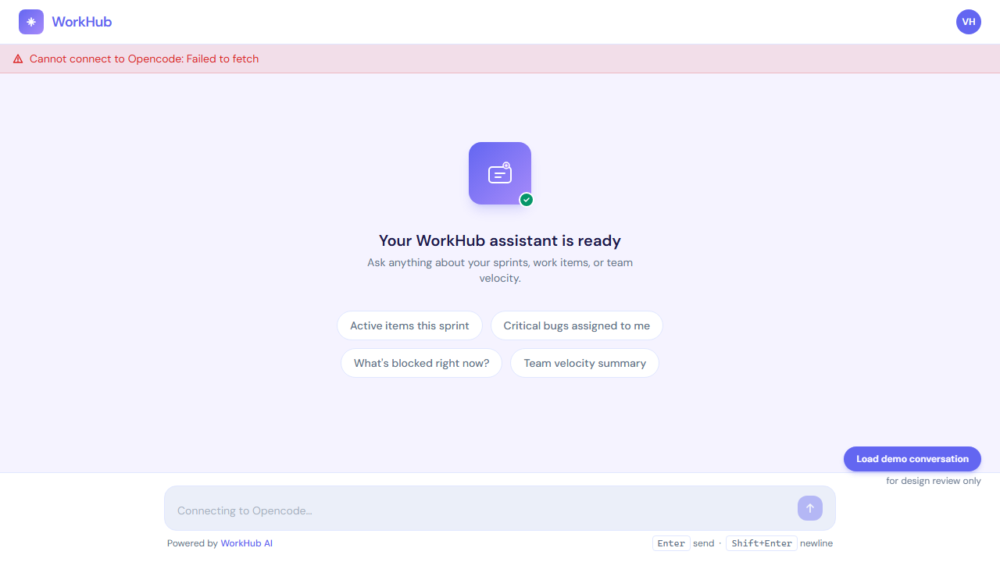
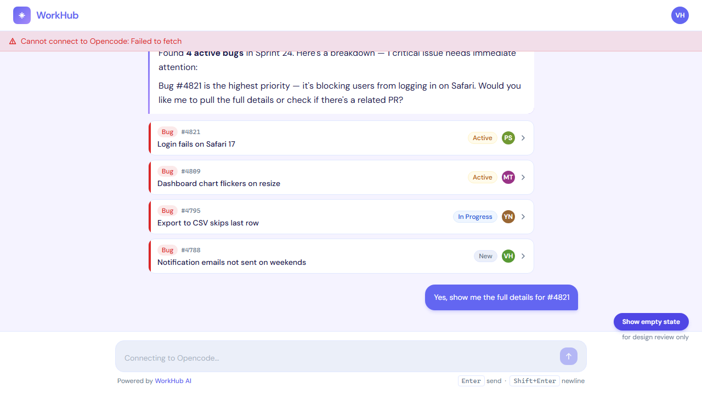
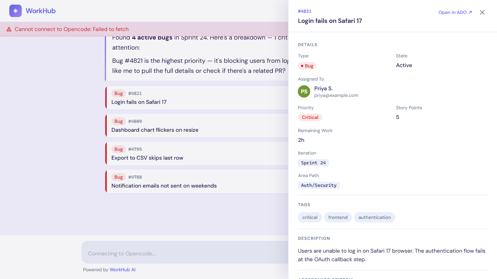

# WorkHub - AI-Powered Azure DevOps Assistant

WorkHub is an intelligent chat interface for Azure DevOps work item management. It seamlessly integrates with the Opencode AI platform to enable conversational querying and interaction with your Azure DevOps work items, bugs, tasks, user stories, and features.

## Features

- **AI-Powered Chat Interface** - Ask questions about your Azure DevOps work items in natural language
- **Intelligent Work Item Extraction** - The AI automatically surfaces relevant work items from your responses with clickable cards and badges
- **Detailed Work Item Inspector** - Click any work item to open a side drawer with comprehensive details including description, acceptance criteria, priority, story points, tags, iteration, area path, and related items
- **Real-Time Streaming** - Experience fluid, real-time responses with incremental text updates and AI reasoning visibility
- **Demo Mode** - Toggle between real data and pre-populated demo conversations for testing and evaluation
- **Rich Markdown Rendering** - Full support for formatted text, code blocks, and structured content in AI responses
- **Session Management** - Automatic session creation and persistence across browser refreshes
- **Azure DevOps Integration** - Deep field mapping for Azure DevOps work item properties and direct links to ADO

## Tech Stack

- **Frontend**: React 18 + TypeScript + Vite
- **State Management**: Zustand
- **Styling**: Tailwind CSS + custom design tokens
- **AI Integration**: Opencode AI SDK
- **Data Fetching**: TanStack React Query
- **Animations**: Framer Motion
- **Markdown Rendering**: React Markdown with sanitization
- **Build Tool**: Vite with React plugin

## Screenshots

### Home Page - Empty State
Get started with suggested queries or toggle demo mode to explore sample work items.



### Demo Flow - AI Response with Work Items
The AI assistant automatically extracts and displays work items as interactive cards within the conversation.



### Work Item Drawer - Detailed View
Click any work item card to open the drawer and explore full details, acceptance criteria, related items, and comments.



## How to Run

### Prerequisites

- **Node.js** 18+ and npm/yarn
- **Opencode Server** running (default: `http://localhost:4096`)
- `.env` file configured with API settings

### Installation

1. **Clone the repository** (if not already done)
   ```bash
   git clone <repository-url>
   cd AzureDevopsTab
   ```

2. **Install dependencies**
   ```bash
   npm install
   ```

3. **Configure environment variables**
   
   Create a `.env` file in the root directory:
   ```env
   VITE_OPENCODE_API_URL=http://localhost:4096
   VITE_OPENCODE_PROVIDER_ID=anthropic
   VITE_OPENCODE_MODEL_ID=claude-sonnet-4-5
   VITE_OPENCODE_AGENT=
   ```
   
   - `VITE_OPENCODE_API_URL` - URL of your Opencode AI backend (defaults to localhost:4096)
   - `VITE_OPENCODE_PROVIDER_ID` - Optional AI provider (e.g., "anthropic", "openai")
   - `VITE_OPENCODE_MODEL_ID` - Optional specific model ID (e.g., "claude-sonnet-4-5")
   - `VITE_OPENCODE_AGENT` - Optional Opencode agent name

### Development

Start the development server:
```bash
npm run dev
```

The application will be available at `http://localhost:5173`

The dev server automatically proxies API requests from `/oc-api` to your Opencode backend.

### Production Build

Build optimized production bundle:
```bash
npm run build
```

Preview the production build locally:
```bash
npm run preview
```

## Project Structure

```
src/
├── api/                    # Opencode SDK integration
│   ├── client.ts          # SDK client initialization
│   └── opencode.ts        # API wrapper functions
├── components/
│   ├── chat/              # Chat interface components
│   ├── layout/            # App layout (AppShell)
│   ├── ui/                # Reusable UI components
│   └── workItem/          # Work item display components
├── hooks/                 # Custom React hooks
│   ├── useSession.ts      # Session management
│   ├── useEventStream.ts  # SSE streaming
│   ├── useSendMessage.ts  # Message submission
│   └── useWorkItemDetail.ts # Work item fetching
├── store/                 # Zustand state management
├── types/                 # TypeScript type definitions
├── lib/                   # Utility functions
│   ├── workItemParser.ts  # DEVTAB block parsing
│   ├── sseClient.ts       # Server-Sent Events client
│   └── markdown.tsx       # Markdown utilities
├── data/                  # Demo data
├── App.tsx               # Root component
└── main.tsx              # Entry point
```

## Key Components

### ChatWindow
Main chat interface with message list and input field. Handles real-time message streaming and AI responses.

### WorkItemDrawer
Side panel that slides in from the right to display comprehensive work item details including:
- Basic info (ID, type, state, assignee)
- Priority, story points, and remaining work
- Description and acceptance criteria
- Related items and comments
- Direct link to open in Azure DevOps

### MessageBubble
Displays individual chat messages with support for:
- User and assistant messages
- AI reasoning blocks (when expanded)
- Tool call visualization
- Work item badges and inline cards
- Markdown rendering with syntax highlighting

### WorkItemCard
Inline work item display within chat messages showing:
- Work item ID and type badge
- Title
- Current state with color coding
- Priority indicator
- Assigned user avatar

## How It Works

1. **Session Creation** - On first visit, a new Opencode session is created and stored in `sessionStorage`
2. **User Message** - When you send a message, the system appends a hidden DEVTAB instruction block telling the AI to include structured work item data
3. **AI Response** - The AI responds conversationally and includes a DEVTAB block with any work items mentioned
4. **Work Item Extraction** - The frontend parses the DEVTAB block and extracts work item data
5. **Display** - Work items are rendered as interactive cards and badges in the conversation
6. **Drawer Interaction** - Clicking a work item opens the drawer, which fetches full details from Azure DevOps

## Demo Mode

Toggle demo mode to explore the application without an Opencode backend:
- Pre-populated sample conversations with 4 bugs
- Full work item details cached for immediate access
- Useful for design review, testing, and demonstrations

## Development Notes

### Azure DevOps Field Mapping
The application maps Azure DevOps field names to display-friendly labels:
- `System.Title` → Title
- `System.WorkItemType` → Type
- `System.State` → State
- `Microsoft.VSTS.Common.Priority` → Priority
- `Microsoft.VSTS.Scheduling.StoryPoints` → Story Points
- And more...

### Styling
Custom Tailwind tokens provide an Azure DevOps-inspired dark theme:
- `ado-bg` - Background color
- `ado-surface` - Surface/card color
- `ado-accent` - Accent color
- `ado-bug`, `ado-story`, `ado-task` - Work item type colors

### State Management
The Zustand store is organized into three slices:
- **Chat** - Messages, session ID, typing state, connection status
- **Drawer** - Drawer visibility, selected work item, cached details
- **App** - Base URL, provider/model configuration

## Troubleshooting

**"Cannot connect to Opencode" error**
- Ensure the Opencode server is running at the URL specified in `.env`
- Check that `VITE_OPENCODE_API_URL` is correctly configured
- Verify network connectivity to the backend

**Work items not showing in demo mode**
- Click "Load demo conversation" button to populate sample data
- Use "Show empty state" button to reset and try again

**Styling issues or layout problems**
- Clear browser cache and rebuild: `npm run build && npm preview`
- Ensure Tailwind CSS is properly built (check for `.css` files in dist/)

## License

See LICENSE file for details.

## Contributing

Contributions are welcome! Please ensure:
- Code follows existing style conventions
- New features are tested with demo mode
- Work item parsing logic is thoroughly tested
- TypeScript types are properly defined
